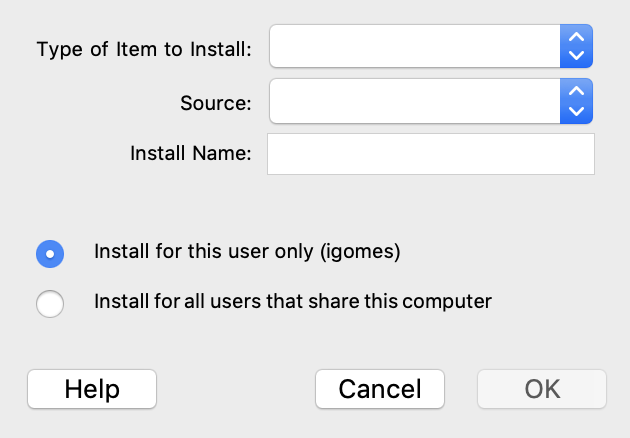

# Mathematica Model Development Kit (MDK)

Mathematica MDK is an application for [Wolfram Mathematica](https://www.wolfram.com/mathematica/) that enables interactions with the [MMS](https://github.com/Open-MBEE/mms-alfresco) such as retrieving analysis inputs and publishing analysis outputs, e.g. computed values, plots, tables.

# Quickstart

## Prerequisites

* [Wolfram Mathematica](https://www.wolfram.com/mathematica/)
* [Model Management System (MMS) 3](https://github.com/Open-MBEE/mms-alfresco)

## Installation

1.  [Download](https://bintray.com/openmbee/maven/mathematica-mdk/_latestVersion) the Mathematica MDK application, e.g. `mathematica-mdk-*.zip`.

2.  Run Mathematica. From the main menu, select "File" > "Install".

    

3.  For "Type of Item to install", select "Application". For "Source", select "From File..." > `mathematica-mdk-*.zip`. Click "OK".

4.  Create a new notebook in Mathematica. Test the install with the following snippet.

        Needs["MDK`"]
        Names["MDK`*"]
        Names["MMS`*"]

    Example output:

        {"CreateBranch", "GetPresentationElement", "Login", "Logout", \
        "MMSUtils", "PublishImageToPresentationElement", \
        "PublishImageURLToPresentationElement", \
        "PublishTableToPresentationElement", \
        "UpdatePresentationElementDocumentation", "UploadFile"}

        {"BasicAuth", "interactive", "SetBasePath", "SetBasicAuth", \
        "SetInteractive", "SetTicketAuth", "TicketAuth"}
5. Check out the [example notebooks](examples).
  

# Local Development

* Run `build.sh` to generate mathematica-mdk zip archive.
* Follow the [Installation](#Installation) instructions.
* Edit the `VERSION` variable in the `build.sh` script to update the mathematica-mms-client.